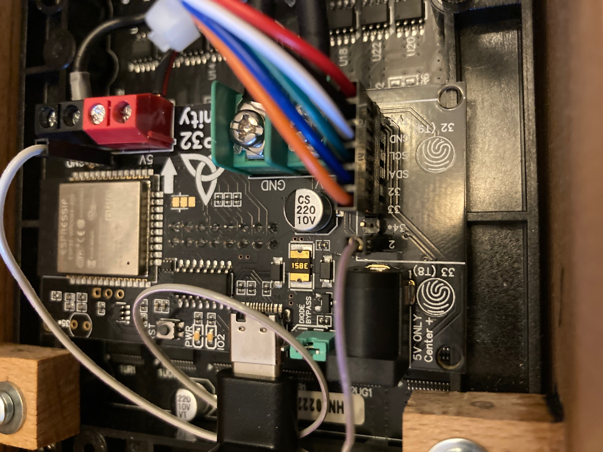

# Assembly Details

The rgbmatrix pictured in this repo was built using the following materials.

- 1x3"x6' of red oak 
- 330x90x3mm matte diffusing acrylic from [here](https://www.tapplastics.com/product/plastics/cut_to_size_plastic/black_led_sheet/668)
- 12x M3x5mm pan head screws
- 3D printed parts in this folder: [models](models/)
- 8x M3 brass heat set inserts for 3D printed parts
- [ESP32-Trinity](https://esp32trinity.com/) 
- (2) 64x32 HUB75 compatible RGB matrix from [here](https://www.aliexpress.com/item/3256801502846969.html)
- 3V SD Card module from [here](https://www.amazon.com/dp/B08CMLG4D6/)
- Panel Mount Barrel Connector from [here](https://www.amazon.com/HiLetgo-Supply-Socket-Female-Connector/dp/B07XCNSM81/)
- 6 short female to female dupont jumper wires
- 8GB SD Card that came with the DE10-Nano
- 5V Power Supply that came with the DE10-Nano

Follow the ESP32-Trinity setup [documentation](https://esp32trinity.com/setup.html) to connect the panels and Trinity together. The SD Card module used above is connected following this table.

|SD Module|Trinity|
|---------|-------|
|CLK|33|
|MISO|32|
|MOSI|SDA (21)|
|CS|SCL (22)|
|3V3|3V3|
|GND|GND|

Once assembled the wiring should look like the following. 

If using different panels and your green and blue matrix colors are swapped, attach pin 2 to ground. See below.

